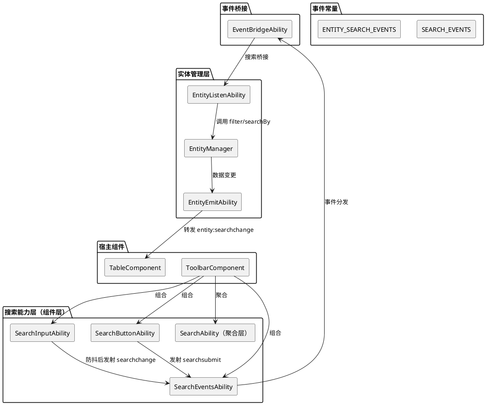
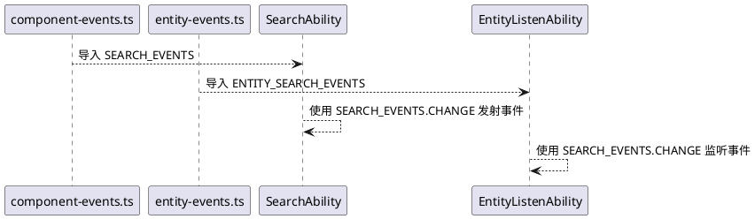
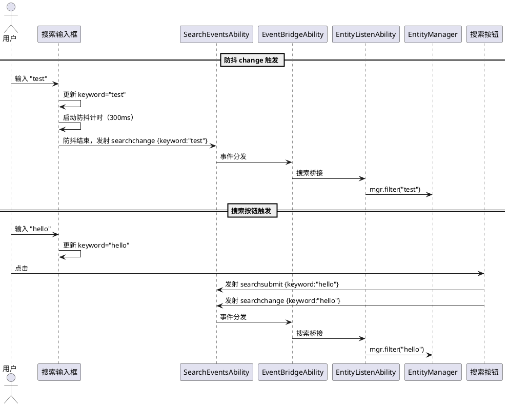
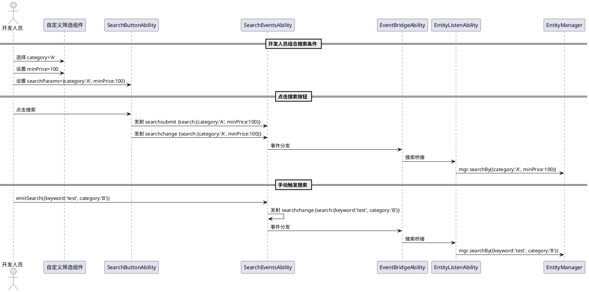
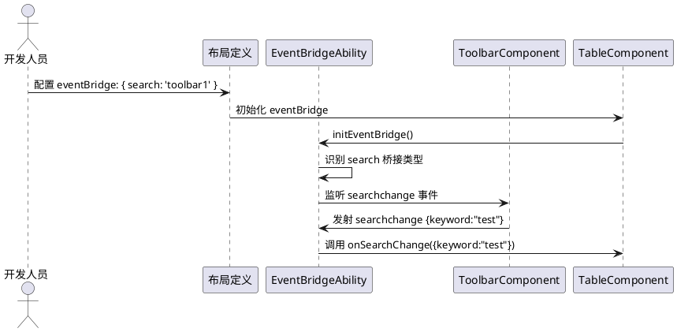
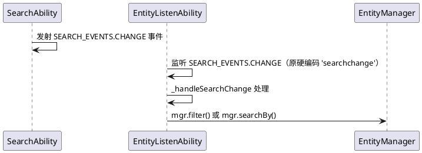
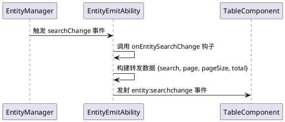
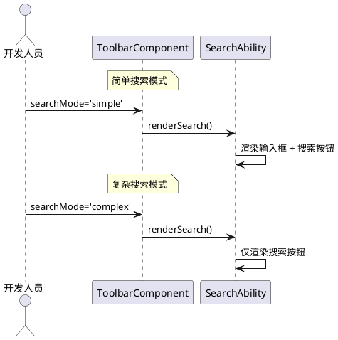

# **1. 组件定位**

## **1.1 核心职责**

本组件负责重构和增强 QimenJS 框架的搜索能力，提供简单搜索与复杂搜索两种模式，补全搜索事件体系，并使组件层搜索能力与实体管理层搜索能力通过事件桥接实现端到端联动。

## **1.2 核心输入**

1. 用户输入的搜索关键词（简单搜索模式）
2. 开发人员自定义的搜索参数对象（复杂搜索模式）
3. 搜索触发方式配置：防抖 change 触发 / 搜索按钮单击触发
4. 防抖时间配置（可自定义，默认 300ms）
5. 搜索按钮的显隐与文本配置

## **1.3 核心输出**

1. 搜索变更事件（searchchange）：携带 keyword 或 search 参数对象
2. 搜索按钮单击事件（searchsubmit）：携带当前 keyword 或自定义参数
3. 搜索 UI 元素：关键词输入框 + 搜索按钮（简单搜索模式）；仅搜索按钮（复杂搜索模式）
4. 实体层搜索事件转发：EntityManager 搜索操作结果通过 EntityEmitAbility 转发为组件事件

## **1.4 职责边界**

1. 不负责数据获取：搜索能力只发出事件，不直接调用 EntityManager 或 HTTP 接口
2. 不负责搜索结果渲染：搜索能力只管理搜索 UI 元素和事件，不管理搜索结果展示
3. 不负责搜索参数转换：后端搜索参数转换由 data-processor 层负责
4. 不负责事件桥接配置：EventBridgeAbility 已有声明式桥接机制，搜索能力只提供桥接类型定义
5. 不修改实体层 SearchAbility 的现有方法签名（toParams/filter/searchBy/matchKeyword/applySort/sort）

# **2. 领域术语**

**简单搜索（Simple Search）**
: 输入关键词即可搜索的模式。框架提供关键词输入框和搜索按钮，支持防抖 change 触发和搜索按钮单击触发两种方式。适用于单一关键词过滤场景。

**复杂搜索（Complex Search）**
: 开发人员自定义搜索条件的模式。框架只提供搜索按钮和搜索事件发射能力，开发人员自行组合其他能力（如下拉筛选、日期范围等）构建搜索条件。适用于多条件组合搜索场景。

**搜索变更事件（searchchange）**
: 搜索条件发生变化时发射的事件。简单搜索模式下由关键词输入（防抖后）触发；复杂搜索模式下由开发人员手动调用触发。事件数据包含 keyword 或 search 字段。

**搜索提交事件（searchsubmit）**
: 点击搜索按钮时发射的事件。简单搜索模式下携带当前 keyword；复杂搜索模式下携带开发人员自定义的搜索参数。

**防抖（Debounce）**
: 对高频触发的输入事件进行延迟处理，在指定时间窗口内只执行最后一次。搜索输入框的 change 事件默认使用 300ms 防抖，避免每次按键都触发搜索。

**搜索桥接（Search Bridge）**
: EventBridgeAbility 中新增的内置桥接类型，用于声明式配置搜索事件从源组件到目标组件的自动转发。与 pagination、crud、selection 桥接同级。

**组件层 SearchAbility**
: 定义在 `src/component-abilities/` 中的搜索能力，为组件提供搜索 UI 和事件发射功能。当前仅有 keyword 和 onSearch 两个属性，需重构增强。

**实体层 SearchAbility**
: 定义在 `src/entity/abilities/search/` 中的搜索能力，为 EntityManager 提供搜索、过滤、排序功能。已有 toParams/filter/searchBy/matchKeyword/applySort/sort 6 个方法，功能完整，不在本次重构范围内。

# **3. 角色与边界**

## **3.1 核心角色**

- **工具栏组件（ToolbarComponent）**：承载搜索 UI 的容器组件，组合搜索能力后显示搜索输入框和按钮
- **表格组件（TableComponent）**：消费搜索事件，通过 EntityListenAbility 将搜索指令传递给 EntityManager
- **开发人员**：使用复杂搜索模式时，自行组合搜索条件并调用搜索 API

## **3.2 外部系统**

- **EntityManager**：接收搜索指令（filter/searchBy），执行数据查询
- **EventBridgeAbility**：声明式桥接搜索事件到消费组件
- **EntityListenAbility**：监听搜索事件并调用 EntityManager 方法
- **EntityEmitAbility**：转发 EntityManager 搜索操作结果为组件事件
- **ComposableBase**：提供 debounce() 方法，搜索能力复用宿主的防抖机制

## **3.3 交互上下文**

# **4. DFX约束**

## **4.1 性能**

- 搜索输入框防抖默认 300ms，可配置，避免高频触发搜索请求
- 搜索 UI 重新渲染必须在 16ms 内完成（单帧）
- 防抖函数通过 ComposableBase.debounce() 创建，宿主 dispose 时自动 cancel

## **4.2 可靠性**

- 搜索事件必须携带完整的搜索上下文（keyword 或 search 对象）
- 防抖期间组件销毁时，待执行的防抖回调必须被取消，不产生幽灵事件
- 搜索按钮点击不受防抖影响，立即触发

## **4.3 安全性**

- 搜索关键词不做内容过滤，由消费方（如 EntityManager）负责参数安全处理

## **4.4 可维护性**

- 搜索能力拆分为子能力（Input/Button/Events），每个子能力独立文件，职责单一
- 事件常量集中管理在 component-events.ts 和 entity-events.ts
- 搜索桥接配置接口与现有 pagination/crud/selection 桥接保持一致的风格

## **4.5 兼容性**

- 重构后的 SearchAbility 必须兼容现有 SelectComponent 对 keyword 属性的使用
- 现有 EntityListenAbility 第 163 行的 `'searchchange'` 硬编码字符串必须替换为 SEARCH_EVENTS.CHANGE 常量
- 新增搜索桥接不影响现有 pagination/crud/selection 桥接的行为
- EntityEmitAbility 新增搜索事件转发不影响现有事件转发逻辑

# **5. 核心能力**

## **5.1 搜索事件常量定义**

### **5.1.1 业务规则**

1. **组件搜索事件常量规则**：`src/events/component-events.ts` 必须新增 `SEARCH_EVENTS` 常量，定义搜索相关事件名
   - 验收条件：[检查 component-events.ts] → [应包含 `SEARCH_EVENTS = { CHANGE: 'searchchange', SUBMIT: 'searchsubmit' }` 常量定义]

2. **实体搜索事件常量规则**：`src/events/entity-events.ts` 必须新增 `ENTITY_SEARCH_EVENTS` 常量，定义实体层搜索事件名
   - 验收条件：[检查 entity-events.ts] → [应包含 `ENTITY_SEARCH_EVENTS = { CHANGE: 'searchChange' }` 常量定义]

3. **事件常量引用规则**：所有使用搜索事件名的代码必须引用常量，禁止硬编码字符串
   - 验收条件：[全局搜索 'searchchange' 字符串字面量] → [除常量定义外不应存在硬编码的 'searchchange' 字符串]

### **5.1.2 交互流程**

## **5.2 简单搜索能力**

### **5.2.1 业务规则**

1. **关键词输入规则**：简单搜索模式必须提供关键词输入框，用户输入内容实时同步到 keyword 属性
   - 验收条件：[用户在搜索输入框输入 "test"] → [keyword 属性值为 "test"]

2. **防抖 change 触发规则**：关键词输入框的 input/change 事件必须经过防抖处理后发射 searchchange 事件
   - 验收条件：[用户连续输入 "abc"，防抖时间 300ms] → [防抖结束后只发射一次 searchchange 事件，keyword 为 "abc"]

3. **防抖时间可配置规则**：防抖等待时间通过 searchDebounce 属性配置，默认 300ms；设为 0 则禁用防抖
   - 验收条件：[设置 searchDebounce=500] → [防抖等待时间为 500ms]；[设置 searchDebounce=0] → [输入立即触发 searchchange，不经过防抖]

4. **搜索按钮触发规则**：点击搜索按钮必须发射 searchsubmit 事件，同时发射 searchchange 事件
   - 验收条件：[keyword="test"，点击搜索按钮] → [发射 searchsubmit 事件 {keyword: "test"}，同时发射 searchchange 事件 {keyword: "test"}]

5. **搜索按钮显隐规则**：搜索按钮通过 showSearchButton 属性控制显隐，默认 true
   - 验收条件：[showSearchButton=false] → [不渲染搜索按钮]；[showSearchButton=true] → [渲染搜索按钮]

6. **搜索按钮文本规则**：搜索按钮文本通过 searchText 属性配置，默认 "搜索"
   - 验收条件：[searchText="查询"] → [搜索按钮显示 "查询"]

7. **空关键词规则**：keyword 为空字符串时，搜索事件仍可正常触发（用于清除搜索条件）
   - 验收条件：[清空输入框，防抖结束后] → [发射 searchchange 事件 {keyword: ""}]

8. **keyword 属性兼容规则**：重构后必须保留 keyword getter/setter 属性，兼容 SelectComponent 等现有使用方
   - 验收条件：[SelectComponent 使用 SearchAbility] → [keyword 属性可正常读写，行为不变]

### **5.2.2 交互流程**

### **5.2.3 异常场景**

1. **防抖期间组件销毁**
   - 触发条件：用户输入后、防抖回调执行前组件被 dispose
   - 系统行为：ComposableBase.dispose() 自动 cancel 所有防抖函数，不执行待执行的防抖回调
   - 用户感知：无搜索事件触发

2. **快速连续点击搜索按钮**
   - 触发条件：用户快速多次点击搜索按钮
   - 系统行为：每次点击都立即发射 searchsubmit 和 searchchange 事件，搜索按钮点击不受防抖影响
   - 用户感知：每次点击都触发搜索

## **5.3 复杂搜索能力**

### **5.3.1 业务规则**

1. **搜索按钮规则**：复杂搜索模式必须提供搜索按钮，点击后发射 searchsubmit 事件
   - 验收条件：[点击搜索按钮] → [发射 searchsubmit 事件，事件数据由开发人员通过 searchParams 属性提供]

2. **搜索事件发射规则**：复杂搜索模式下，开发人员通过调用 `emitSearch(params)` 方法手动发射 searchchange 事件
   - 验收条件：[调用 emitSearch({status: 'active', dateRange: '2024'})] → [发射 searchchange 事件 {search: {status: 'active', dateRange: '2024'}}]

3. **搜索参数属性规则**：搜索参数通过 searchParams 属性设置，类型为 Record<string, any>
   - 验收条件：[设置 searchParams={category: 'A', minPrice: 100}] → [点击搜索按钮时 searchsubmit 事件携带 {search: {category: 'A', minPrice: 100}}]

4. **搜索按钮文本可配置规则**：复杂搜索模式的搜索按钮文本通过 searchText 属性配置，默认 "搜索"
   - 验收条件：[searchText="筛选"] → [搜索按钮显示 "筛选"]

5. **不渲染输入框规则**：复杂搜索模式下不渲染关键词输入框，搜索条件由开发人员自行构建
   - 验收条件：[searchMode='complex'] → [DOM 中不存在搜索输入框]

6. **与简单搜索互斥规则**：同一搜索能力实例只能处于一种模式，通过 searchMode 属性切换
   - 验收条件：[searchMode='simple'] → [渲染输入框+按钮]；[searchMode='complex'] → [仅渲染按钮]

### **5.3.2 交互流程**

### **5.3.3 异常场景**

1. **searchParams 为空**
   - 触发条件：点击搜索按钮时 searchParams 未设置或为空对象
   - 系统行为：searchsubmit 事件携带空 search 对象，searchchange 事件同样携带空 search 对象
   - 用户感知：搜索按钮可点击，事件正常触发

2. **emitSearch 参数为空**
   - 触发条件：调用 emitSearch() 不传参数
   - 系统行为：不发射事件，方法静默返回
   - 用户感知：无搜索事件触发

## **5.4 搜索事件桥接**

### **5.4.1 业务规则**

1. **搜索桥接类型规则**：EventBridgeAbility 必须新增 search 内置桥接类型，与 pagination/crud/selection 同级
   - 验收条件：[配置 eventBridge: { search: 'myToolbar' }] → [自动监听 myToolbar 的 searchchange 事件，调用宿主的 onSearchChange 方法]

2. **搜索桥接配置接口规则**：新增 SearchBridgeConfig 接口，包含 source、enabled 字段
   - 验收条件：[检查 EventBridgeAbility.ts] → [应包含 SearchBridgeConfig 接口定义，与 PaginationBridgeConfig 风格一致]

3. **搜索桥接字符串简写规则**：搜索桥接支持字符串简写（source id）和完整配置对象两种形式
   - 验收条件：[eventBridge: { search: 'toolbar1' }] → [等价于 eventBridge: { search: { source: 'toolbar1' } }]

4. **内置桥接 key 集合更新规则**：BUILTIN_BRIDGE_KEYS 必须新增 'search'，使搜索桥接走内置桥接逻辑而非自定义桥接逻辑
   - 验收条件：[检查 BUILTIN_BRIDGE_KEYS] → [应包含 'pagination', 'crud', 'selection', 'search']

5. **搜索桥接事件映射规则**：搜索桥接监听 SEARCH_EVENTS.CHANGE 事件，调用宿主的 onSearchChange 方法
   - 验收条件：[源组件发射 searchchange 事件] → [目标组件的 onSearchChange 方法被调用，参数为事件数据]

### **5.4.2 交互流程**

### **5.4.3 异常场景**

1. **源组件不存在**
   - 触发条件：搜索桥接配置的 source id 对应的组件尚未注册
   - 系统行为：normalizeBridgeConfig 返回配置，但 _bridgeOn 中 get(source) 返回 null，不创建监听
   - 用户感知：搜索事件不被转发

## **5.5 EntityListenAbility 搜索监听修复**

### **5.5.1 业务规则**

1. **硬编码字符串替换规则**：EntityListenAbility 第 163 行的 `'searchchange'` 硬编码字符串必须替换为 `SEARCH_EVENTS.CHANGE` 常量
   - 验收条件：[检查 EntityListenAbility.ts _bindSearchListener 方法] → [应使用 `SEARCH_EVENTS.CHANGE` 而非字符串字面量 `'searchchange'`]

2. **搜索事件导入规则**：EntityListenAbility 必须从 `@qimenjs/events` 导入 `SEARCH_EVENTS` 常量
   - 验收条件：[检查 EntityListenAbility.ts 顶部导入] → [应包含 `import { SEARCH_EVENTS } from '@qimenjs/events'`]

3. **搜索处理逻辑不变规则**：_handleSearchChange 方法的处理逻辑保持不变，仅替换事件名常量
   - 验收条件：[替换后运行现有测试] → [所有测试通过，搜索监听行为不变]

### **5.5.2 交互流程**

## **5.6 EntityEmitAbility 搜索事件转发**

### **5.6.1 业务规则**

1. **搜索事件转发规则**：EntityEmitAbility 必须转发 EntityManager 的搜索变更事件为组件事件
   - 验收条件：[EntityManager 触发 searchChange 事件] → [EntityEmitAbility 转发为 entity:searchchange 组件事件]

2. **搜索事件转发数据规则**：转发的搜索事件数据必须包含搜索上下文信息
   - 验收条件：[搜索事件转发数据] → [应包含 search 字段（当前搜索参数）和分页上下文（page/pageSize/total 等）]

3. **搜索事件钩子规则**：搜索事件转发前必须调用 onEntitySearchChange 钩子，钩子可阻止转发或替换数据
   - 验收条件：[定义 onEntitySearchChange 返回 false] → [搜索事件不被转发]；[返回对象] → [使用返回的对象作为转发数据]

4. **ENTITY_EVENTS 常量更新规则**：component-events.ts 中的 ENTITY_EVENTS 必须新增 SEARCH_CHANGE 键
   - 验收条件：[检查 ENTITY_EVENTS] → [应包含 `SEARCH_CHANGE: 'entity:searchchange'`]

### **5.6.2 交互流程**

## **5.7 搜索能力聚合层**

### **5.7.1 业务规则**

1. **聚合层兼容规则**：重构后的 SearchAbility 聚合层必须兼容现有 SelectComponent 对 keyword 和 onSearch 的使用
   - 验收条件：[SelectComponent 使用 SearchAbility] → [keyword 属性可正常读写，onSearch 回调可正常设置]

2. **聚合层组合规则**：SearchAbility 聚合层通过 Object.assign 合并 SearchInputAbility、SearchButtonAbility、SearchEventsAbility，与 PaginationAbility 聚合层模式一致
   - 验收条件：[检查 SearchAbility 导出] → [应包含 SearchInputAbility、SearchButtonAbility、SearchEventsAbility 的所有属性和方法]

3. **搜索模式默认值规则**：searchMode 默认为 'simple'，即简单搜索模式
   - 验收条件：[未设置 searchMode] → [默认渲染输入框+搜索按钮]

4. **渲染协调规则**：SearchAbility 聚合层提供 renderSearch() 方法，统一协调搜索 UI 的渲染
   - 验收条件：[调用 renderSearch()] → [根据 searchMode 渲染对应的搜索 UI 元素]

### **5.7.2 交互流程**

# **6. 数据约束**

## **6.1 搜索配置对象**

1. **searchMode**：搜索模式，枚举值 'simple' | 'complex'，默认 'simple'
2. **searchDebounce**：防抖等待时间，非负整数（毫秒），默认 300，0 表示禁用防抖
3. **showSearchButton**：是否显示搜索按钮，布尔值，默认 true
4. **searchText**：搜索按钮文本，字符串，默认 "搜索"
5. **searchPlaceholder**：搜索输入框占位文本，字符串，默认 "请输入关键词"
6. **searchParams**：复杂搜索模式的搜索参数，Record<string, any>，默认 {}

## **6.2 搜索事件数据**

1. **searchchange 事件（简单搜索）**：`{ keyword: string }`
2. **searchchange 事件（复杂搜索）**：`{ search: Record<string, any> }`
3. **searchsubmit 事件（简单搜索）**：`{ keyword: string }`
4. **searchsubmit 事件（复杂搜索）**：`{ search: Record<string, any> }`
5. **entity:searchchange 事件**：`{ search: Record<string, any>, page?: number, pageSize?: number, total?: number }`

## **6.3 搜索桥接配置**

1. **SearchBridgeConfig.source**：事件源组件 id，字符串，必填
2. **SearchBridgeConfig.enabled**：是否启用，布尔值，默认 true

## **6.4 搜索位置常量**

1. **SEARCH_POSITIONS.INPUT**：搜索输入框位置，默认 5
2. **SEARCH_POSITIONS.BUTTON**：搜索按钮位置，默认 8

# **7. 影响范围**

## **7.1 需要新增的文件**

| 文件路径 | 说明 |
|---------|------|
| `src/component-abilities/toolbar/SearchInputAbility.ts` | 搜索输入框子能力（关键词输入、防抖 change 触发） |
| `src/component-abilities/toolbar/SearchButtonAbility.ts` | 搜索按钮子能力（按钮渲染、点击事件） |
| `src/component-abilities/toolbar/SearchEventsAbility.ts` | 搜索事件子能力（searchchange/searchsubmit 事件发射、emitSearch 方法） |
| `src/component-abilities/toolbar/search-positions.ts` | 搜索位置常量 |
| `src/component-abilities/toolbar/SearchAbility.ts` | 搜索聚合层（合并子能力，兼容旧接口） |

## **7.2 需要修改的文件**

| 文件路径 | 修改内容 |
|---------|---------|
| `src/events/component-events.ts` | 新增 SEARCH_EVENTS 常量、ENTITY_EVENTS 新增 SEARCH_CHANGE |
| `src/events/entity-events.ts` | 新增 ENTITY_SEARCH_EVENTS 常量 |
| `src/component-core/abilities/EventBridgeAbility.ts` | 新增 SearchBridgeConfig 接口、search 桥接逻辑、BUILTIN_BRIDGE_KEYS 新增 'search' |
| `src/component-abilities/entity/EntityListenAbility.ts` | 替换硬编码 'searchchange' 为 SEARCH_EVENTS.CHANGE 常量 |
| `src/component-abilities/entity/EntityEmitAbility.ts` | 新增搜索事件转发逻辑 |
| `src/component-abilities/interaction/SearchAbility.ts` | 保留但标记为 @deprecated，引导使用 toolbar/SearchAbility |
| `src/component-abilities/interaction/index.ts` | 保留导出，添加 @deprecated 注释 |
| `src/component-abilities/toolbar/index.ts` | 新增 SearchAbility 导出 |
| `src/component/components/ToolbarComponent.ts` | 新增 SearchAbility 到 abilities 数组 |

## **7.3 不需要修改的文件**

| 文件路径 | 原因 |
|---------|------|
| `src/entity/abilities/search/SearchAbility.ts` | 实体层搜索能力功能完整，不在本次重构范围 |
| `src/component/components/SelectComponent.ts` | 继续使用 interaction/SearchAbility，keyword 属性兼容 |
