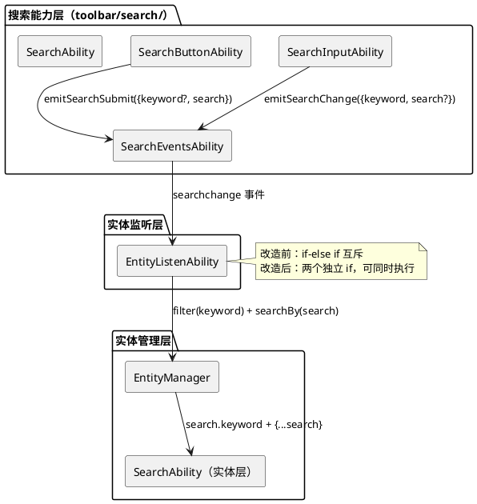
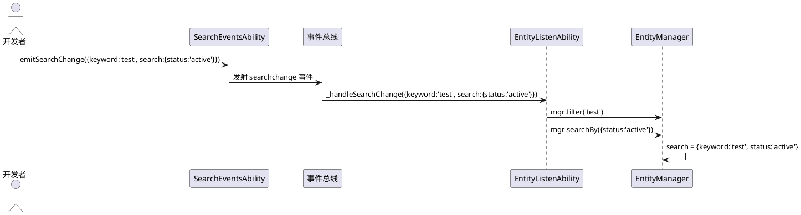
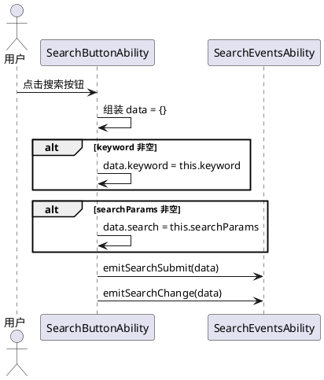
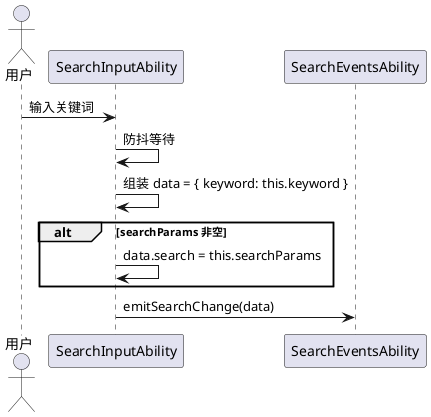
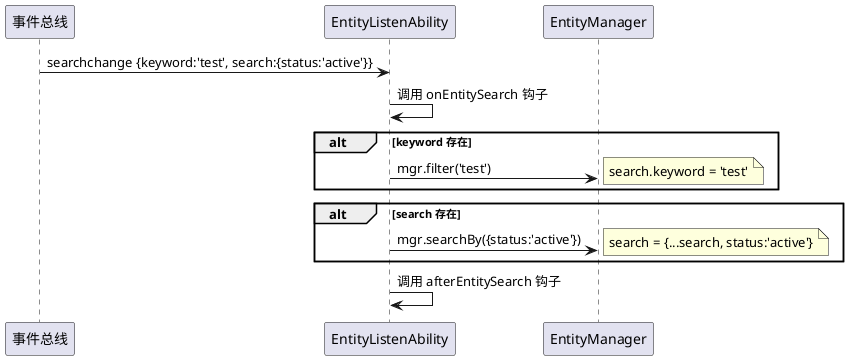
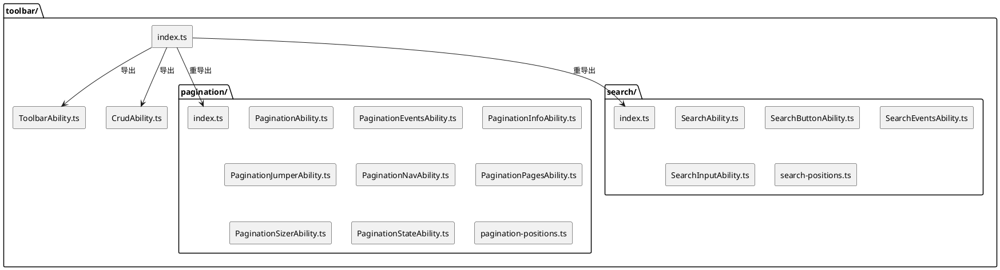

# **1. 组件定位**

## **1.1 核心职责**

本组件负责解决 QimenJS 框架 toolbar 搜索能力中 keyword 与 searchParams 互斥查询的问题，实现组合查询能力；同时对 toolbar 目录按功能分类建子文件夹，改善代码组织结构。

## **1.2 核心输入**

1. 当前简单搜索模式只发 `{ keyword }` 事件，复杂搜索模式只发 `{ search: searchParams }` 事件，两者互斥
2. EntityListenAbility._handleSearchChange 中 if-else if 互斥分支，keyword 优先截断 search 通道
3. 底层实体层 SearchAbility.filter() 和 searchBy() 已天然支持组合（filter 写 search.keyword，searchBy 用展开合并不覆盖 keyword）
4. toolbar 目录下 17 个文件全部平铺，分页和搜索文件混在一起

## **1.3 核心输出**

1. keyword 和 searchParams 可同时存在、组合查询
2. searchMode 语义从"互斥模式选择"调整为"UI 渲染模式"（simple=显示输入框，complex=隐藏输入框）
3. 事件数据统一为 `{ keyword?, search? }` 组合结构
4. toolbar 目录按功能分类：pagination/ 子目录、search/ 子目录
5. 根 index.ts 统一导出，外部引用路径不受影响

## **1.4 职责边界**

- 本组件不负责修改实体层 SearchAbility（filter/searchBy/matchKeyword 等方法）
- 本组件不负责修改 ComponentEventBusAbility 的桥接配置
- 本组件不负责修改 SEARCH_EVENTS 事件常量定义
- 本组件不负责修改 ToolbarAbility 和 CrudAbility 的核心逻辑
- 本组件不负责修改 component-abilities/index.ts 的顶层导出（导出链路不变）

# **2. 领域术语**

**keyword**
: 简单搜索关键词，由用户在输入框中输入的文本字符串，用于前端模糊匹配。

**searchParams**
: 复杂搜索参数，类型为 `Record<string, any>`，由开发者通过 API 设置的结构化搜索条件（如 `{ status: 'active', minPrice: 100 }`）。

**组合查询**
: keyword 和 searchParams 同时存在、共同参与搜索过滤的查询模式。底层实体层已天然支持：filter() 将 keyword 写入 search.keyword，searchBy() 用展开合并不覆盖已有 keyword。

**searchMode**
: 搜索模式，取值 `'simple' | 'complex'`。改造前语义为"互斥模式选择"（simple 只发 keyword，complex 只发 searchParams）；改造后语义调整为"UI 渲染模式"（simple=显示输入框+按钮，complex=仅显示按钮），无论哪种模式事件数据均可同时携带 keyword 和 search。

**SearchEventsAbility**
: 搜索事件分发能力，提供 emitSearchChange/emitSearchSubmit/emitSearch 方法，是搜索能力的核心基础层。

**SearchInputAbility**
: 搜索输入框能力，管理关键词输入框 UI 和防抖 change 触发，仅在 searchMode === 'simple' 时渲染输入框。

**SearchButtonAbility**
: 搜索按钮能力，管理搜索按钮 UI 和点击事件，根据 searchMode 决定事件数据内容。

**EntityListenAbility**
: 实体监听能力，监听组件事件并调用 EntityManager 执行操作。_handleSearchChange 方法当前使用 if-else if 互斥分支处理 keyword 和 search。

**toolbar 目录重组**
: 将 toolbar 目录下 17 个平铺文件按功能分类移入子目录：分页相关移入 pagination/，搜索相关移入 search/，ToolbarAbility.ts 和 CrudAbility.ts 保留在根目录。

# **3. 角色与边界**

## **3.1 核心角色**

- **框架开发者**：修改搜索事件数据结构和 EntityListenAbility 分支逻辑，重组 toolbar 目录结构
- **框架使用者**：依赖 QimenJS 框架搜索能力的应用开发者，受事件数据结构变更影响

## **3.2 外部系统**

- **EntityListenAbility**：消费搜索事件，调用 EntityManager 的 filter/searchBy 方法
- **EntityManager**：底层实体管理器，filter() 和 searchBy() 已天然支持组合
- **ComponentEventBusAbility**：声明式桥接搜索事件到消费组件

## **3.3 交互上下文**



# **4. DFX约束**

## **4.1 性能**

- 事件数据结构变更不影响运行时性能
- EntityListenAbility 从 if-else if 改为两个独立 if，最坏情况多执行一次 mgr 方法调用，但语义正确

## **4.2 可靠性**

- 组合查询改造后，所有现有测试必须通过
- 仅传 keyword 或仅传 searchParams 的场景行为与改造前一致

## **4.3 安全性**

无特殊安全要求。

## **4.4 可维护性**

- 事件数据结构统一为 `{ keyword?, search? }`，消除互斥分支的隐含约束
- toolbar 目录按功能分类，降低文件查找成本
- searchMode 语义明确为 UI 渲染模式，降低理解成本

## **4.5 兼容性**

- 仅传 `{ keyword }` 的事件数据仍可正常处理（向后兼容）
- 仅传 `{ search }` 的事件数据仍可正常处理（向后兼容）
- toolbar 目录重组后，根 index.ts 统一导出，外部 `from '@qimenjs/component-abilities'` 引用路径不变
- component-abilities/index.ts 的顶层导出不变

# **5. 核心能力**

## **5.1 搜索事件数据结构统一（P0）**

### **5.1.1 业务规则**

1. **事件数据组合结构规则**：emitSearchChange 和 emitSearchSubmit 的参数类型应从 `{ keyword: string } | { search: Record<string, any> }` 联合类型调整为 `{ keyword?: string; search?: Record<string, any> }` 组合类型

   a. 验收条件：[调用 emitSearchChange({ keyword: 'test', search: { status: 'active' } })] → [应同时携带 keyword 和 search 字段发射事件]

2. **仅 keyword 兼容规则**：仅传 keyword 时，事件数据格式为 `{ keyword: string }`，行为与改造前一致

   a. 验收条件：[调用 emitSearchChange({ keyword: 'test' })] → [应正常发射事件，EntityListenAbility 正确调用 mgr.filter('test')]

3. **仅 search 兼容规则**：仅传 search 时，事件数据格式为 `{ search: Record<string, any> }`，行为与改造前一致

   a. 验收条件：[调用 emitSearchChange({ search: { status: 'active' } })] → [应正常发射事件，EntityListenAbility 正确调用 mgr.searchBy({ status: 'active' })]

4. **emitSearch 方法兼容规则**：emitSearch(params) 应继续以 `{ search: params }` 格式发射事件

   a. 验收条件：[调用 emitSearch({ status: 'active' })] → [应发射 searchchange 事件，数据为 `{ search: { status: 'active' } }`]

### **5.1.2 交互流程**



### **5.1.3 异常场景**

1. **keyword 和 search 均为空**

   a. 触发条件：调用 emitSearchChange({}) 或 emitSearchChange({ keyword: '', search: {} })

   b. 系统行为：事件正常发射，EntityListenAbility 中 keyword 为空字符串时不调用 filter，search 为空对象时不调用 searchBy

   c. 用户感知：无搜索操作执行

## **5.2 SearchButtonAbility 组合数据组装（P0）**

### **5.2.1 业务规则**

1. **始终组装完整数据规则**：SearchButtonAbility 点击搜索按钮时，应始终组装包含 keyword 和 search 的完整事件数据，而非根据 searchMode 互斥选择

   a. 验收条件：[searchMode='simple'，searchParams={status:'active'}，点击搜索按钮] → [应发射 `{ keyword: this.keyword, search: this.searchParams }`]

2. **simple 模式组合规则**：searchMode='simple' 时，事件数据应同时携带 keyword 和 searchParams（如果 searchParams 非空）

   a. 验收条件：[searchMode='simple'，keyword='test'，searchParams={status:'active'}，点击搜索按钮] → [emitSearchSubmit 和 emitSearchChange 的数据均为 `{ keyword: 'test', search: { status: 'active' } }`]

3. **complex 模式组合规则**：searchMode='complex' 时，事件数据应同时携带 keyword（如果 keyword 非空）和 searchParams

   a. 验收条件：[searchMode='complex'，keyword='test'，searchParams={status:'active'}，点击搜索按钮] → [emitSearchSubmit 和 emitSearchChange 的数据均为 `{ keyword: 'test', search: { status: 'active' } }`]

4. **空值省略规则**：keyword 为空字符串时，事件数据中可省略 keyword 字段；searchParams 为空对象时，事件数据中可省略 search 字段

   a. 验收条件：[keyword=''，searchParams={status:'active'}，点击搜索按钮] → [事件数据为 `{ search: { status: 'active' } }`，不含 keyword 字段]

### **5.2.2 交互流程**



### **5.2.3 异常场景**

1. **keyword 和 searchParams 均为空**

   a. 触发条件：keyword='' 且 searchParams={}

   b. 系统行为：事件数据为 `{}`，事件正常发射

   c. 用户感知：EntityListenAbility 不执行任何搜索操作

## **5.3 SearchInputAbility 组合数据携带（P0）**

### **5.3.1 业务规则**

1. **输入框防抖事件携带 searchParams 规则**：SearchInputAbility 输入框 input 事件防抖后发射 searchchange 时，应同时携带当前 searchParams（如果非空）

   a. 验收条件：[keyword='test'，searchParams={status:'active'}，输入框 input 事件触发] → [防抖后发射 `{ keyword: 'test', search: { status: 'active' } }`]

2. **仅 keyword 场景兼容规则**：searchParams 为空对象时，事件数据仅包含 keyword，行为与改造前一致

   a. 验收条件：[keyword='test'，searchParams={}，输入框 input 事件触发] → [防抖后发射 `{ keyword: 'test' }`]

### **5.3.2 交互流程**



## **5.4 EntityListenAbility 互斥分支消除（P0）**

### **5.4.1 业务规则**

1. **独立 if 分支规则**：_handleSearchChange 中 keyword 和 search 的处理应从 if-else if 互斥分支改为两个独立 if 分支，允许同时执行

   a. 验收条件：[事件数据为 `{ keyword: 'test', search: { status: 'active' } }`] → [应先调用 mgr.filter('test')，再调用 mgr.searchBy({ status: 'active' })]

2. **仅 keyword 兼容规则**：仅存在 keyword 时，只调用 mgr.filter，行为与改造前一致

   a. 验收条件：[事件数据为 `{ keyword: 'test' }`] → [应调用 mgr.filter('test')，不调用 mgr.searchBy]

3. **仅 search 兼容规则**：仅存在 search 时，只调用 mgr.searchBy，行为与改造前一致

   a. 验收条件：[事件数据为 `{ search: { status: 'active' } }`] → [应调用 mgr.searchBy({ status: 'active' })，不调用 mgr.filter]

4. **执行顺序规则**：当 keyword 和 search 同时存在时，应先调用 mgr.filter(keyword) 再调用 mgr.searchBy(search)

   a. 验收条件：[事件数据同时包含 keyword 和 search] → [mgr.filter 应在 mgr.searchBy 之前被调用]

### **5.4.2 交互流程**



### **5.4.3 异常场景**

1. **mgr.filter 不存在但 mgr.searchBy 存在**

   a. 触发条件：事件数据包含 keyword，但 mgr.filter 不是函数

   b. 系统行为：跳过 filter 调用，继续执行 searchBy 调用

   c. 用户感知：仅 searchBy 生效

2. **mgr.searchBy 不存在但 mgr.filter 存在**

   a. 触发条件：事件数据包含 search，但 mgr.searchBy 不是函数

   b. 系统行为：跳过 searchBy 调用，filter 已正常执行

   c. 用户感知：仅 filter 生效

## **5.5 searchMode 语义调整（P1）**

### **5.5.1 业务规则**

1. **UI 渲染模式规则**：searchMode 的语义从"互斥模式选择"调整为"UI 渲染模式"，仅控制输入框的显隐，不影响事件数据结构

   a. 验收条件：[searchMode='simple'] → [渲染输入框+搜索按钮，事件数据可同时携带 keyword 和 search]

2. **complex 模式输入框隐藏规则**：searchMode='complex' 时，输入框不渲染，但 keyword 属性仍可通过 API 设置

   a. 验收条件：[searchMode='complex'，通过 API 设置 keyword='test'] → [输入框不渲染，但搜索按钮点击时事件数据可携带 keyword='test']

3. **文档注释更新规则**：SearchInputAbility 和 SearchButtonAbility 的 JSDoc 注释应更新 searchMode 的语义描述

   a. 验收条件：[检查 SearchInputAbility 的 searchMode 属性注释] → [应描述为"UI 渲染模式：simple=显示输入框+搜索按钮，complex=仅显示搜索按钮"，而非"互斥模式选择"]

## **5.6 toolbar 目录按功能分类重组（P1）**

### **5.6.1 业务规则**

1. **分页文件移入 pagination/ 子目录规则**：所有分页相关文件应移入 toolbar/pagination/ 子目录

   a. 验收条件：[检查 toolbar/pagination/ 目录] → [应包含 PaginationAbility.ts、PaginationEventsAbility.ts、PaginationInfoAbility.ts、PaginationJumperAbility.ts、PaginationNavAbility.ts、PaginationPagesAbility.ts、PaginationSizerAbility.ts、PaginationStateAbility.ts、pagination-positions.ts]

2. **搜索文件移入 search/ 子目录规则**：所有搜索相关文件应移入 toolbar/search/ 子目录

   a. 验收条件：[检查 toolbar/search/ 目录] → [应包含 SearchAbility.ts、SearchButtonAbility.ts、SearchEventsAbility.ts、SearchInputAbility.ts、search-positions.ts]

3. **根目录保留规则**：ToolbarAbility.ts、CrudAbility.ts 和 index.ts 保留在 toolbar/ 根目录

   a. 验收条件：[检查 toolbar/ 根目录] → [应仅包含 index.ts、ToolbarAbility.ts、CrudAbility.ts、pagination/ 子目录、search/ 子目录]

4. **根 index.ts 统一导出规则**：toolbar/index.ts 应从子目录重新导出所有公共 API，外部引用路径不变

   a. 验收条件：[外部代码 `import { SearchAbility } from '@qimenjs/component-abilities'`] → [应正常工作，无需修改导入路径]

5. **子目录内部导入路径规则**：子目录内文件之间的相对导入路径不变（同目录内引用），跨子目录引用需调整路径

   a. 验收条件：[检查 search/SearchAbility.ts 中的 import 语句] → [从同目录导入 SearchInputAbility 等应使用 `'./SearchInputAbility'`，无需跨目录引用]

6. **pagination/ 子目录 index.ts 规则**：pagination/ 子目录应提供 index.ts 统一导出分页相关 API

   a. 验收条件：[检查 toolbar/pagination/index.ts] → [应导出 PaginationAbility、PAGINATION_POSITIONS、PaginationStateAbility、PaginationEventsAbility、PaginationNavAbility、PaginationPagesAbility、PaginationJumperAbility、PaginationSizerAbility、PaginationInfoAbility]

7. **search/ 子目录 index.ts 规则**：search/ 子目录应提供 index.ts 统一导出搜索相关 API

   a. 验收条件：[检查 toolbar/search/index.ts] → [应导出 SearchAbility、SEARCH_POSITIONS、SearchInputAbility、SearchButtonAbility、SearchEventsAbility]

### **5.6.2 交互流程**



### **5.6.3 异常场景**

1. **外部直接引用子文件路径**

   a. 触发条件：外部代码使用 `from '@qimenjs/component-abilities/toolbar/SearchAbility'` 等深层路径导入

   b. 系统行为：路径变更后导入失败

   c. 修复方案：推荐使用顶层 `from '@qimenjs/component-abilities'` 导入；如需深层导入，toolbar/index.ts 已重导出所有公共 API

# **6. 数据约束**

## **6.1 事件数据结构变更**

1. **改造前**：`{ keyword: string } | { search: Record<string, any> }`（联合类型，互斥）
2. **改造后**：`{ keyword?: string; search?: Record<string, any> }`（组合类型，可共存）

## **6.2 SearchEventsAbility 方法签名变更**

| 方法 | 改造前签名 | 改造后签名 |
|------|-----------|-----------|
| emitSearchChange | `(data: { keyword: string } \| { search: Record<string, any> }): void` | `(data: { keyword?: string; search?: Record<string, any> }): void` |
| emitSearchSubmit | `(data: { keyword: string } \| { search: Record<string, any> }): void` | `(data: { keyword?: string; search?: Record<string, any> }): void` |
| emitSearch | `(params: Record<string, any>): void` | 不变 |

## **6.3 EntityListenAbility._handleSearchChange 逻辑变更**

1. **改造前**：
   ```typescript
   if (eventData?.keyword !== undefined && typeof this.mgr.filter === 'function') {
       this.mgr.filter(eventData.keyword);
   } else if (eventData?.search && typeof this.mgr.searchBy === 'function') {
       this.mgr.searchBy(eventData.search);
   }
   ```
2. **改造后**：
   ```typescript
   if (eventData?.keyword !== undefined && typeof this.mgr.filter === 'function') {
       this.mgr.filter(eventData.keyword);
   }
   if (eventData?.search && typeof this.mgr.searchBy === 'function') {
       this.mgr.searchBy(eventData.search);
   }
   ```

## **6.4 目录结构变更**

| 改造前路径 | 改造后路径 |
|-----------|-----------|
| toolbar/PaginationAbility.ts | toolbar/pagination/PaginationAbility.ts |
| toolbar/PaginationEventsAbility.ts | toolbar/pagination/PaginationEventsAbility.ts |
| toolbar/PaginationInfoAbility.ts | toolbar/pagination/PaginationInfoAbility.ts |
| toolbar/PaginationJumperAbility.ts | toolbar/pagination/PaginationJumperAbility.ts |
| toolbar/PaginationNavAbility.ts | toolbar/pagination/PaginationNavAbility.ts |
| toolbar/PaginationPagesAbility.ts | toolbar/pagination/PaginationPagesAbility.ts |
| toolbar/PaginationSizerAbility.ts | toolbar/pagination/PaginationSizerAbility.ts |
| toolbar/PaginationStateAbility.ts | toolbar/pagination/PaginationStateAbility.ts |
| toolbar/pagination-positions.ts | toolbar/pagination/pagination-positions.ts |
| toolbar/SearchAbility.ts | toolbar/search/SearchAbility.ts |
| toolbar/SearchButtonAbility.ts | toolbar/search/SearchButtonAbility.ts |
| toolbar/SearchEventsAbility.ts | toolbar/search/SearchEventsAbility.ts |
| toolbar/SearchInputAbility.ts | toolbar/search/SearchInputAbility.ts |
| toolbar/search-positions.ts | toolbar/search/search-positions.ts |
| toolbar/ToolbarAbility.ts | toolbar/ToolbarAbility.ts（不变） |
| toolbar/CrudAbility.ts | toolbar/CrudAbility.ts（不变） |
| toolbar/index.ts | toolbar/index.ts（更新导出路径） |

## **6.5 影响范围**

### 需要修改的文件

1. `src/component-abilities/toolbar/SearchEventsAbility.ts` — 类型签名变更
2. `src/component-abilities/toolbar/SearchInputAbility.ts` — 事件数据携带 searchParams
3. `src/component-abilities/toolbar/SearchButtonAbility.ts` — 始终组装完整数据
4. `src/component-abilities/entity/EntityListenAbility.ts` — if-else if → 两个独立 if

### 需要移动的文件

1. 9 个分页文件 → `toolbar/pagination/`
2. 5 个搜索文件 → `toolbar/search/`

### 需要新建的文件

1. `toolbar/pagination/index.ts` — 分页子目录统一导出
2. `toolbar/search/index.ts` — 搜索子目录统一导出

### 需要更新导出路径的文件

1. `toolbar/index.ts` — 从子目录重导出

### 不需要修改的文件

1. `entity/abilities/search/SearchAbility.ts` — 底层实体层，已天然支持组合
2. `component-abilities/index.ts` — 顶层导出不变
3. `ToolbarAbility.ts` — 保留在根目录，逻辑不变
4. `CrudAbility.ts` — 保留在根目录，逻辑不变
